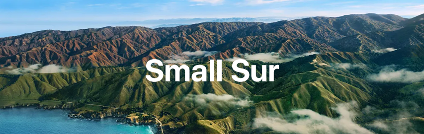

<p align="center"> 
</p>

# Small Sur
Small Sur is a theme that brings the visual aesthetics of macOS Big Sur to XFCE desktop environment. It is essentially a theme designed to give your Linux desktop a look and feel similar to that of macOS Big Sur. 

## Table of contents
- [Screenshots](#screenshots)
- [Features](#features)
- [Requirements](#requirements)
- [Installation](#installation)
  - [For Debian/Ubuntu](#for-debianubuntu)
  - [For Arch/Manjaro](#for-archmanjaro)
  - [For Fedora](#for-fedora)
- [Usage](#usage)
- [For Gnome Users](#for-gnome-users)
- [Contribute](#contribute)
- [Credits](#credits)

## Screenshots


## Features
- Sleek and modern design inspired by macOS Big Sur.
- Unified and consistent appearance across various applications and system elements.
- Customizable dock and top bar.
- Collection of wallpapers which suitable for this theme.
- BigSur icons and cursors.

## Requirements
Before installing Small Sur, ensure that you have the following requirements are met:
- XFCE desktop environment 
- Install plank, ulancher, vala-panel-appmenu manually

## Installation
### For Debian/Ubuntu
```bash
git clone https://github.com/jothi-prasath/SmallSur
```
```bash
cd SmallSur
```
```bash
sudo ./install-debian.sh
``` 

### For Arch/Manjaro
```bash
git clone https://github.com/jothi-prasath/SmallSur
```
```bash
cd SmallSur
```
```bash
sudo ./install-arch.sh
```
### For Fedora
```bash
git clone https://github.com/jothi-prasath/SmallSur
```
```bash
cd SmallSur
```
```bash
sudo ./install-fedora.sh
```
Note: By default, the wallpapers are installed in the Pictures folder in your home directory.

## Usage
Once the SmallSur theme is installed, you can customize your XFCE desktop environment to match the style. Here are some recommended configurations:
- Adjust the Plank settings to customize the dock appearance and behavior.
- Configure the XFCE panel to organize and manage the top bar elements.
- Set your preferred SmallSur wallpaper from the provided collection.

Feel free to explore and experiment with different configurations to personalize your desktop experience.

## For Gnome Users
If you are using the Gnome desktop environment, you can check out my other project, [Gnomintosh](https://github.com/jothi-prasath/gnomintosh). Gnomintosh provides a macOS-inspired theme specifically designed for Gnome. It includes themes, icons, and other customization elements to give your Gnome desktop a sleek and modern look.

<p align="center"> <a href="https://github.com/jothi-prasath/gnomintosh">


</a> </p>

## Star


## Contribute

Contributions are welcome! If you would like to contribute to the Small Sur project, please follow these steps:
- Test the script thoroughly to ensure it works as expected.
- Add inline comments in the code where appropriate, especially for complex or non-obvious sections, to enhance code readability and maintainability.

## Credits 
GTK Theme - https://github.com/vinceliuice/WhiteSur-gtk-theme

Icon - https://github.com/vinceliuice/WhiteSur-icon-theme 

Cursor - https://github.com/vinceliuice/WhiteSur-cursors

Plank Theme - https://www.gnome-look.org/p/1399398/