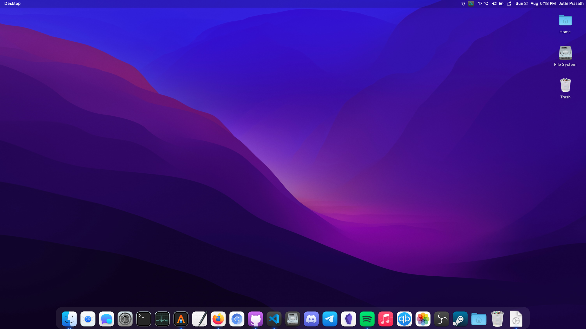
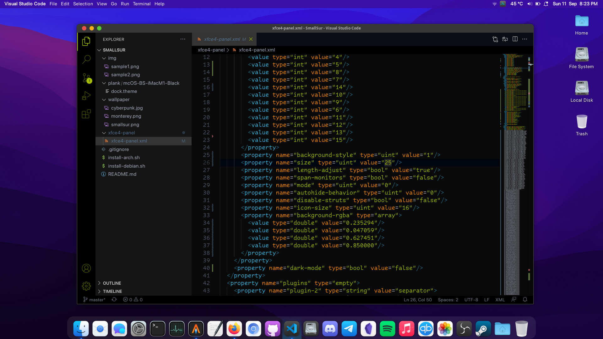
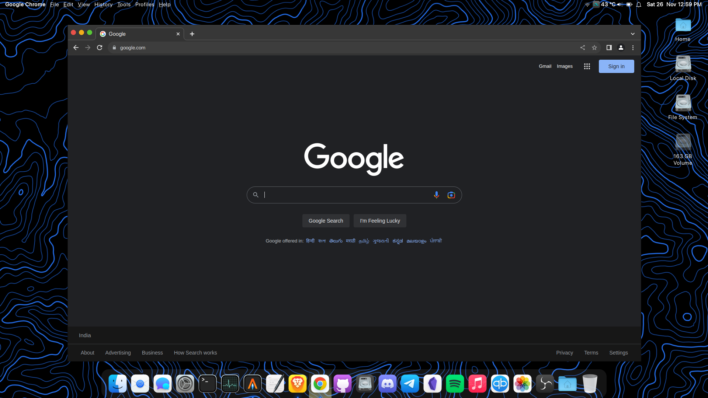

<h1 align="center"> Small Sur </h1>
<p align="center">  </p>
<p align="center">  </p>
<p align="center">  </p>


## Quick install 
### For Debian/Ubuntu
```
sudo ./install-debian.sh
``` 

### For Arch/Manjaro
```
sudo ./install-arch.sh
```
### For Fedora
#### Install plank, ulancher, vala-panel-appmenu manually
```
sudo ./install-fedora.sh
```

(Set wallpaper from ~/Pictures folder and install plank & ulauncher)

## Install plank & Albert
#### For Debian/Ubuntu
```
sudo apt update
sudo apt install plank -y
sudo apt install albert -y
```
#### For Arch/Manjaro
```
sudo pacman --needed -Sy plank albert
```
(note: Enable AUR to install albert)

## Contribute

Contributions are welcome! If you would like to contribute to the Small Sur project, please follow these steps:
* Test the script thoroughly to ensure it works as expected.
* Add inline comments in the code where appropriate, especially for complex or non-obvious sections, to enhance code readability and maintainability.


## Credits 
GTK Theme - https://github.com/vinceliuice/WhiteSur-gtk-theme

Icon - https://github.com/vinceliuice/WhiteSur-icon-theme 

Cursor - https://github.com/vinceliuice/WhiteSur-cursors

Plank Theme - https://www.gnome-look.org/p/1399398/
