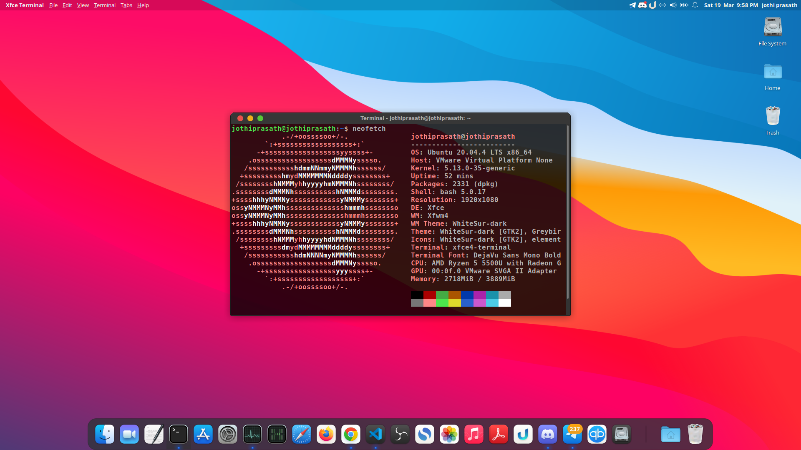
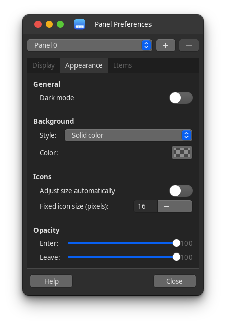
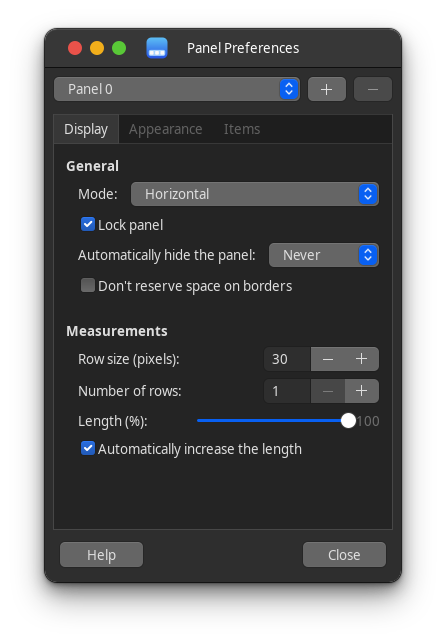
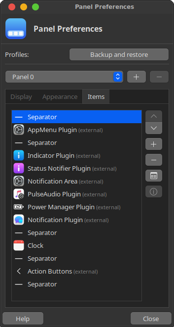

<h1 align="center"> Small Sur </h1>

  

### Quick install 
Run `./install.sh` with `sudo` to install the theme

### Panel preferences

  
   
  

### Credits 
gtk theme - https://github.com/vinceliuice/WhiteSur-gtk-theme

icon - https://github.com/vinceliuice/WhiteSur-icon-theme 

cursor - https://github.com/vinceliuice/WhiteSur-cursors